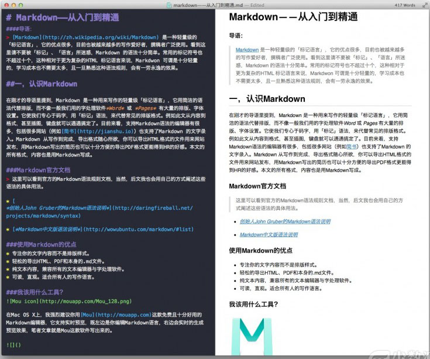
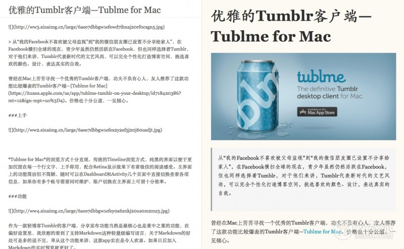
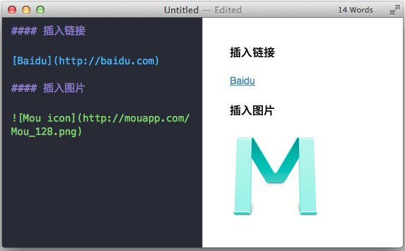

* 《三国演义》第一百一十五回到一百二十回结束
* 学习SaltStack，完成学习总结报告及测试工作
* 学习MarkDown基础语法

# 1. Markdown
Markdown 是一种轻量级的「标记语言」，它的优点很多，目前也被越来越多的写作爱好者，撰稿者
广泛使用。看到这里请不要被「标记」、「语言」所迷惑，Markdown 的语法十分简单。常用的标记
符号也不超过十个，这种相对于更为复杂的HTML 标记语言来说，Markdown 可谓是十分轻量的，学
习成本也不需要太多，且一旦熟悉这种语法规则，会有一劳永逸的效果。

# 一、认识Markdown
在刚才的导语里提到，Markdown 是一种用来写作的轻量级「标记语言」，它用简洁的语法代替排版
，而不像一般我们用的字处理软件 Word 或 Pages 有大量的排版、字体设置。它使我们专心于码字
，用「标记」语法，来代替常见的排版格式。例如此文从内容到格式，甚至插图，键盘就可以通通搞
定了。目前来看，支持 Markdown 语法的编辑器有很多，包括很多网站（例如简书）也支持了
 Markdown 的文字录入。Markdown 从写作到完成，导出格式随心所欲，你可以导出 HTML 格式的
 文件用来网站发布，也可以十分方便的导出 PDF 格式，这种格式写出的简历更能得到 HR 的好感。
 甚至可以利用 CloudApp 这种云服务工具直接上传至网页用来分享你的文章，全球最大的轻博客平
 台 Tumblr，也支持使用 Mou 这类 Markdown 工具进行编辑并直接上传。

 ## Markdown官方文档
 > 这里可以看到官方的 Markdown 语法规则文档，当然，后文我也会用自己的方式，阐述这些语
 法在实际使用中的用法。

 * [创始人 John Gruber 的 Markdown 语法说明](http://daringfireball.net/projects/markdown/syntax)
 * [Markdown 中文版语法说明](http://wowubuntu.com/markdown/#list)

## 使用 Markdown 的优点
* 专注你的文字内容而不是排版样式。
* 轻松的导出 HTML、PDF 和本身的 .md 文件。
* 纯文本内容，兼容所有的文本编辑器与字处理软件。
* 可读，直观。适合所有人的写作语言。

## 我该用什么工具？

### Mac
* 在 Mac OS X 上，我强烈建议你用 Mou 这款免费且十分好用的 Markdown 编辑器，它支持实时
预览，既左边是你编辑 Markdown 语言，右边会实时的生成预览效果，笔者文章就是 Mou 这款应用
写出来的。

其次还有很多同类选择。如果你是个编辑作者，我强烈建议你购买 Ulysses Ⅲ，这款应用入围了苹
果去年 Mac App Store 的 The Best of 2013，相比 Mou 它支持更多的写作格式、多文档的支
持。Mou、iA Writer 这些应用都是基于单文档的管理方式，而 Ulysses Ⅲ 支持 Folder、
Filter 的管理，一个 Folder 里面可以创建多个 Sheet，Sheet 之间还可以进行 Combine 处理。

### Windows、iOS、Web 平台
* 笔者并未使用过 Windows 下的 Markdown 工具，但经朋友介绍，有两款还算不错，一款叫
MarkdownPad ，另一款叫 MarkPad。

* iOS 端已有相当多的 app 支持 Markdown 语法编辑，例如 Drafts、Day One、iA Writer 等。

* Web 端上，我强烈推荐 简书 这款产品，上面有无数热爱文字的人在不停的创造、分享。在 Web
端使用 Markdown 没有比简书更舒服的地方了，它同样支持左右两栏的实时预览，字体优雅、简洁。

* 同样是 Web 端，Draftin 这款在线 MD 编辑器也近乎完美。

# 二、Markdown语法简要

## 1. 标题
标题是每篇文章都需要也是最常用的格式，在 Markdown 中，如果一段文字被定义为标题，只要在
这段文字前加 # 号即可。
# 一级标题
## 二级标题
### 三级标题

以此类推，总共六级标题，建议在井号后加一个空格，这是最标准的 Markdown 语法。

## 2. 列表
熟悉 HTML 的同学肯定知道有序列表与无序列表的区别，在 Markdown 下，列表的显示只需要在文
字前加上 - 或 * 即可变为无序列表，有序列表则直接在文字前加 1. 2. 3. 符号要和文字之间加
上一个字符的空格。

## 3. 引用
如果你需要引用一小段别处的句子，那么就要用引用的格式。
> 例如这样

只需要在文本前加入 > 这种尖括号（大于号）即可

## 4. 图片与链接
插入链接与插入图片的语法很像，区别在一个 !号
插入图片的地址需要图床，这里推荐 CloudApp 的服务，生成URL地址即可。

## 5. 粗体与斜体
Markdown 的粗体和斜体也非常简单，用两个 * 包含一段文本就是粗体的语法，用一个 * 包含一段
文本就是斜体的语法。

例如：这里是**粗体**这里是*斜体*

## 6. 表格
表格是我觉得 Markdown 比较累人的地方，例子如下：

`
| Tables        | Are           | Cool  |
| ------------- |:-------------:| -----:|
| col 3 is      | right-aligned | $1600 |
| col 2 is      | centered      |   $12 |
| zebra stripes | are neat      |    $1 |
`

这种语法生成的表格如下：

| Tables        | Are           | Cool  |
| ------------- |:-------------:| -----:|
| col 3 is      | right-aligned | $1600 |
| col 2 is      | centered      |   $12 |
| zebra stripes | are neat      |    $1 |

## 7. 分割线
分割线的语法只需要另起一行，连续输入三个星号 \*\*\* 即可。
***

# 三、小结
到这里，Markdown 的基本语法在日常的使用中基本就没什么大问题了，只要多加练习，配合好用的
工具，写起东西来肯定会行云流水。更多的语法规则，其实 Mou 的 Help 文档例子很好，当你第一
次使用 Mou 时，就会显示该文档，其次，你也可在撰写过程中，使用 CMD+R 快捷键来快速打开文
档，以随时查阅和学习语法。

# 四、与 Markdown 相关的一些推荐

*
